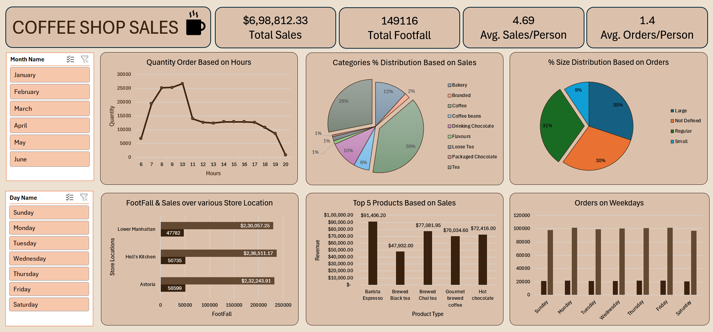

# ☕ Coffee Shop Sales Analysis - Excel Dashboard

## 📌 Project Objective
The main objective of this project is to analyze retail sales data to gain actionable insights that will enhance the performance of the Coffee Shop.

## 📊 Dashboard Preview

## ❓ Business Questions Answered & Key Insights

Based on the dashboard analysis, here are the insights derived from the data:

**1. How do sales vary by day of the week and hour of the day? Are there any peak times?**
* **Peak Hours:** The highest order volume clearly occurs during the morning rush between **8:00 AM and 10:00 AM** (peaking at over 25,000 orders). After 11:00 AM, the sales volume drops and maintains a steady pace until closing time.
* **By Day:** Sales and order volumes remain highly consistent across all weekdays, showing steady daily customer habits.

**2. What is the total sales revenue for each month?**
* The total revenue for the recorded period (Jan - June) is **$6,98,812.33** with a total footfall of **149,116**. (Users can use the "Month Name" slicer in the dashboard to dynamically view revenue for individual months).

**3. How do sales vary across different store locations?**
* All three store locations perform competitively, but **Hell's Kitchen** leads the chart with **$2,36,511.17** in sales (50,735 footfall). 
* **Astoria** follows closely with $2,32,243.91 (50,599 footfall), and **Lower Manhattan** records $2,30,057.25 (47,782 footfall).

**4. What is the average price/order per person?**
* The average sales (spend) per person is **$4.69**.
* The average orders per person is **1.4**.

**5. Which products are the best-selling in terms of revenue?**
* **Barista Espresso** is the top-performing product, generating the highest revenue of **$91,406.20**.
* It is followed by **Brewed Chai tea** ($77,081.95) and **Hot chocolate** ($72,416.00).

**6. How do sales vary by product category and type?**
* **Category Distribution:** **Coffee** dominates the overall sales, contributing to **39%** of the total revenue. **Tea** is the second most popular category at **28%**, followed by **Bakery** items at **12%**.
* **Size Preference:** Customers show an equal preference for **Regular (31%)** and **Large (30%)** sizes, whereas Small sizes account for only 9% of the orders.

## 🛠️ Data Processing & Tools
* **Data Cleaning & Transformation:** Utilized **Excel Power Query (Get & Transform)** to clean, format, and structure the raw dataset efficiently before analysis.
* **Data Modeling:** Pivot Tables and Pivot Charts.
* **Visualization:** Highly interactive dashboard with Slicers for seamless temporal filtering (by Month and Day).

## 📂 Raw Data Included for Practice!
I have included the raw dataset as a zip file (`Coffee Shop Sales.zip`) in this repository. If you are learning Data Analysis or Excel, feel free to download the data, extract it, and try building your own dashboard!

## 🚀 How to Use This Project
1. Clone this repository or download the files.
2. Open the `Coffee_Shop_Sales_Dashboard.xlsx` file in Microsoft Excel.
3. Use the Slicers (Month Name, Day Name) on the left panel to interact with the dashboard and uncover dynamic insights.
